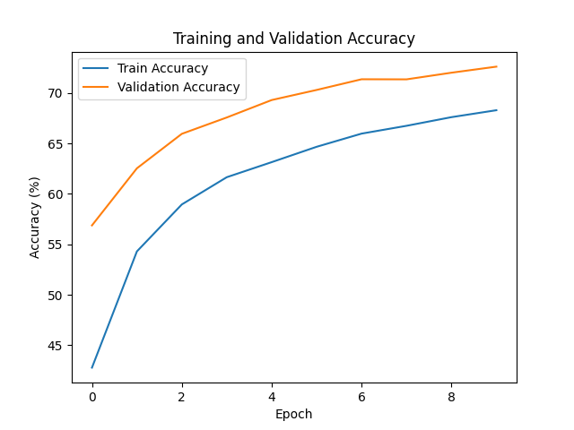
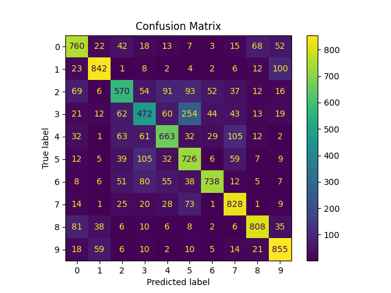

# Звіт про виконання завдання

## Завдання
1. **CNN (Convolutional Neural Network)**:
   - Завантажити та підготувати зображення.
   - Побудувати архітектуру CNN для класифікації зображень.
   - Провести тренування та оцінку моделі.
   - Зберегти результати, графіки точності та матрицю плутанини.

2. **RNN (Recurrent Neural Network)**:
   - Завантажити та підготувати текстовий корпус.
   - Побудувати архітектуру RNN для генерації тексту.
   - Провести тренування та згенерувати текст.
   - Зберегти результати та згенерований текст.

---

## Частина 1: CNN для класифікації зображень

### **1. Завантаження та обробка даних**
- Використано датасет **CIFAR-10**.
- Дані розділено на навчальну та тестову вибірки.
- Виконано нормалізацію пікселів до діапазону [-1, 1].
- Використано аугментацію:
  - Випадкове горизонтальне віддзеркалення.
  - Повороти зображень на ±10 градусів.

### **2. Архітектура CNN**
- Реалізовано модель з такими шарами:
  - **Два згорткові шари (Conv2D)** з активацією ReLU.
  - **Шари підсемплювання (MaxPooling2D)** після кожного згорткового шару.
  - **Flatten (Розгортання)**.
  - **Два повнозв’язні шари (Dense)**:
    - Один із 128 нейронами та активацією ReLU.
    - Вихідний шар із 10 нейронами для класифікації.

### **3. Результати CNN**
- **Графік точності навчання та валідації**:
  

- **Матриця плутанини**:
  

- **Точність моделі на тестовій вибірці**:


## Висновки по CNN

- **Точність на тестовій вибірці:** Модель досягла 73.05% точності після 10 епох навчання.
- **Результати:** 
  - Графік точності навчання та валідації показує, що модель добре узгоджується з даними.
  - Матриця плутанини ілюструє, як модель класифікує кожен із 10 класів CIFAR-10.

---

## Частина 2: RNN для генерації тексту

### **1. Завантаження та обробка даних**
- Завантажено текстовий корпус з файлу `data/text_corpus.txt`.
- Перетворено текст у числові індекси:
- Створено словник символів: кожному символу відповідає унікальний числовий індекс.
- Розбито текст на послідовності довжиною 100 символів.

### **2. Архітектура RNN**
- Реалізовано модель з такими шарами:
- **Вбудовування (Embedding)** для представлення символів.
- **Рекурентний шар (LSTM)** із 256 нейронами та 2 шарами.
- **Вихідний шар (Dense)** для передбачення ймовірностей наступного символу.

## 3. Навчання та результати

### Опис
- **Кількість епох:** 10.
- **Оптимізатор:** Adam із швидкістю навчання 0.001.
- **Функція втрат:** CrossEntropyLoss.
- **Розмір прихованого шару:** 256.
- **Кількість рекурентних шарів:** 2.

### Результати навчання
| Епоха | Loss   |
| ----- | ------ |
| 1     | 3.0634 |
| 2     | 2.8454 |
| 3     | 2.5146 |
| 4     | 2.1106 |
| 5     | 1.7897 |
| 6     | 1.4270 |
| 7     | 1.1074 |
| 8     | 0.7711 |
| 9     | 0.4886 |
| 10    | 0.3720 |

### Код
```python
from rnn_train_model import train_rnn

# Навчання моделі
train_rnn(
    model=model,
    data_loader=data_loader,
    dataset=dataset,
    num_epochs=10,
    lr=0.001,
    device=device,
    output_dir='outputs'
)
```

# Висновки по RNN


Модель поступово знижувала втрати (Loss) протягом усіх епох, що свідчить про успішне навчання.

Після 10 епох втрати знизилися до 0.3720, що демонструє хорошу відповідність навчальному корпусу.

---

##### Встановлення та активація середовища
```
./setup_env.sh
source _env_/bin/acStivate
pip install torch torchvision matplotlib scikit-learn
```